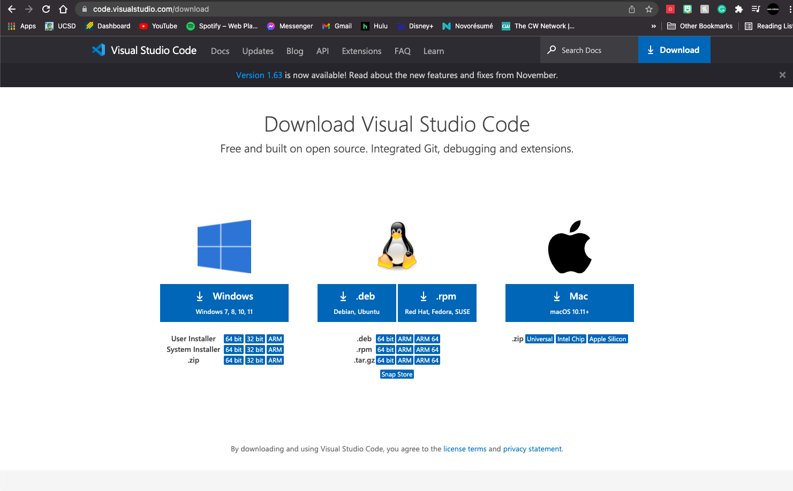
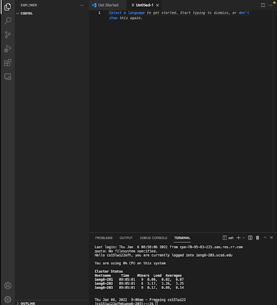
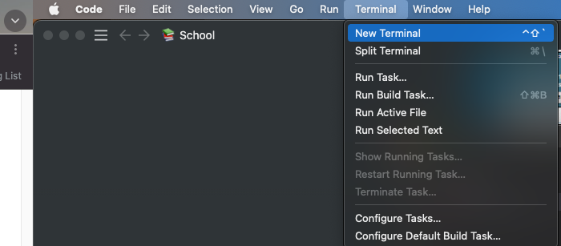
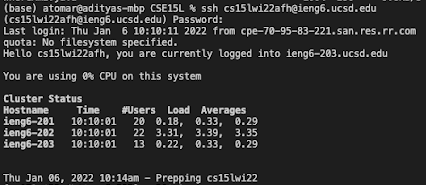
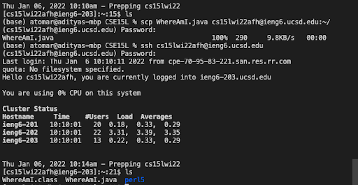
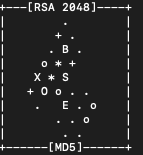
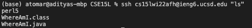
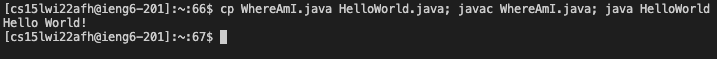

# **Remote Access**
This page is about how we can log onto a course specific account on `ieng`
## **Installing Visual Code Studio**
Visual Studio Code is a code editor for writing code and building applications. It is very useful in *version control* as it supports an integrated version of *Git*

To download Visual Studio Code, use this link [here](https://code.visualstudio.com/download) to download the version that correlates with your OS.



### **Opening VS Code**
When is installed, you can open a new window that looks like the one below with your desired setting and preferences



## **Remotely Connecting**
Courses at UCSD use course-specific accounts. These systems are equivalent to what you would see if you worked in the industry. In this section we will see how we can use VScode to connect to a remote computer, or *server* using a program called *OpenSSH*.

We first have to make sure that OpenSSH is downloaded on our local system. If you're using Windows, following the instructions in the tutorial that is in this link: 

[Install OpenSSH](https://docs.microsoft.com/en-us/windows-server/administration/openssh/openssh_install_firstuse) 

Once you've had OpenSSH downloaded (if you're a Windows user), move on to the next step in looking up for your account CSE15L:

[UCSD account look-up](https://sdacs.ucsd.edu/~icc/index.php)

### **Connecting to a Remote Host**
Once you've found your account save the address somewhere on your computer for later reference. 

We will move on to the next step, in VScode, we will connect your client to the server using VScode option to connect to remote servers.

Do the following steps:

1. open a Terminal window in VScode(Ctrl or Command +, or use the Terminal menu option on the top of the window) and type the `ssh` command to connect to the `ieng` server.



Your command will look like this:

`$ ssh cs15lwi22zz@ieng.ucsd.edu`

where the `zz` should be replaced with the three characters that are in your course-specific account


2. You will proably see a message regarding the RSA key fingerprint, just type `yes` and enter as we'll discuss how to create the key later.

Once you type yes you will see something like this:



Congratulations! you have connected the terminal to the server `ieng` 

## **Trying Some Commands**
Now that you are connected, try running the `ls`,`cd`,`mkdir`, and `pwd` commands in the terminal.

These commands mean different things in terminal like information about files, directories, and creating them.

To logout of `ieng`, run the command `exit` or `ctrl/command-D`

## **Moving Files with `scp`**
Now we have seen so far how to work on local and remote computers. One useful thing that *working remotely* enables us to do is copy files to and from the server to our client. To copy a file from your computer to the remote computer let's use the `scp` command, and this will be used **only** from the client. Let's try an example!

1. Create file called `WhereAmI.java` and copy paste the following code:

```java
class WhereAmI {public static void main(String[] args) {
     System.out.println(System.getProperty("os.name"));
     System.out.println(System.getProperty("user.name"));
     System.out.println(System.getProperty("user.home"));
     System.out.println(System.getProperty("user.dir"));
  }
}
```
You can run this using `javac` and `java` on your client

In the terminal window, in the same directory as your new file, run

`scp WhereAmI.java cs15lwi22zz@ieng6.ucsd.edu:~/`

Enter your password to sign into `ssh` and to give consent that you mean to copy the file to the server



Navigate to your new copied file using the `ls` command and that it has successfully been copied in your directory!

Now you can run it on `ieng` with the same `javac` and `java` commands as before

## **Setting an SSH Key**
Everytime, you copy files you have to login and enter your password in and run `scp` on your files however you can make it faster by using what is called an **SSH Key**.

The `ssh-keygen` program generates a pair of files a *private* and *public* key. You put the *public* key somewhere in the server and the *private* key on your client computer. Then run `ssh` which will use the pair of files as a substitute for a password. Here's how to do it:

First, run the `ssh-keygen` command on your client terminal window. You will the key has generated with the keyart looking something like this:



This should have created two files `id_rsa` and `id_rsa.pub` into a directory called `.ssh` somewhere on your computer.

Now, sign in to the server and using `ssh` and create a directory called `.ssh` using the `mkdir` command: 

`$ mkdir .ssh`

Now we need to copy the **public** key (the file called `id_rsa.pub`) from the client to the server using `scp`

``` $ scp /Users/joe/.ssh/id_rsa.pub cs15lwi22@ieng6.ucsd.edu:~/.ssh/authorized_keys```

Presto! Now, you don't have to sign in with your password anymore when you run `ssh` and `scp`!
## **Optimizing Remote Running**
There are some ways you can optimize the speed at which you can run your files on the server. Here's few of them:

* Run the `ls` command by entering "ls" after you use `ssh`, like so:



* Use semicolons to run multiple commands on the same line in terminal, try:


* Also: remember you can use the `^` key to retrieve the last command that was run!
